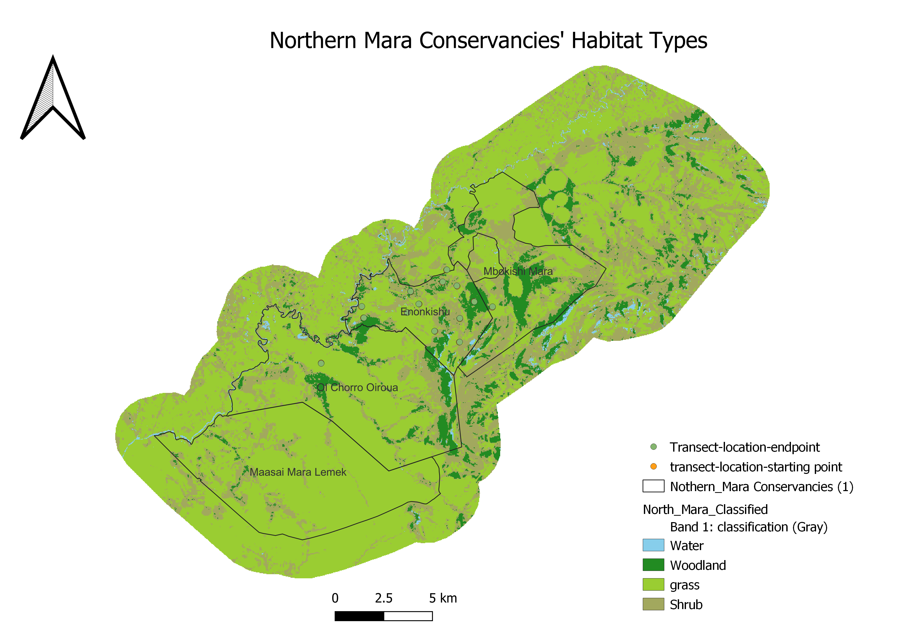
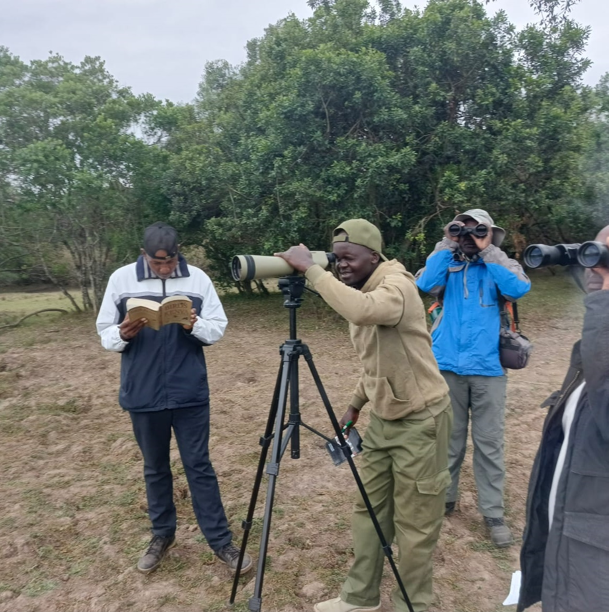
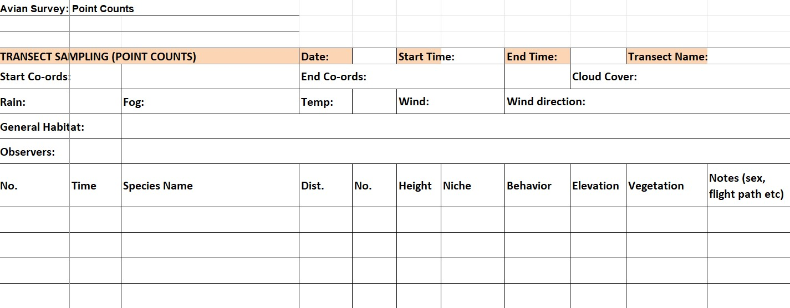
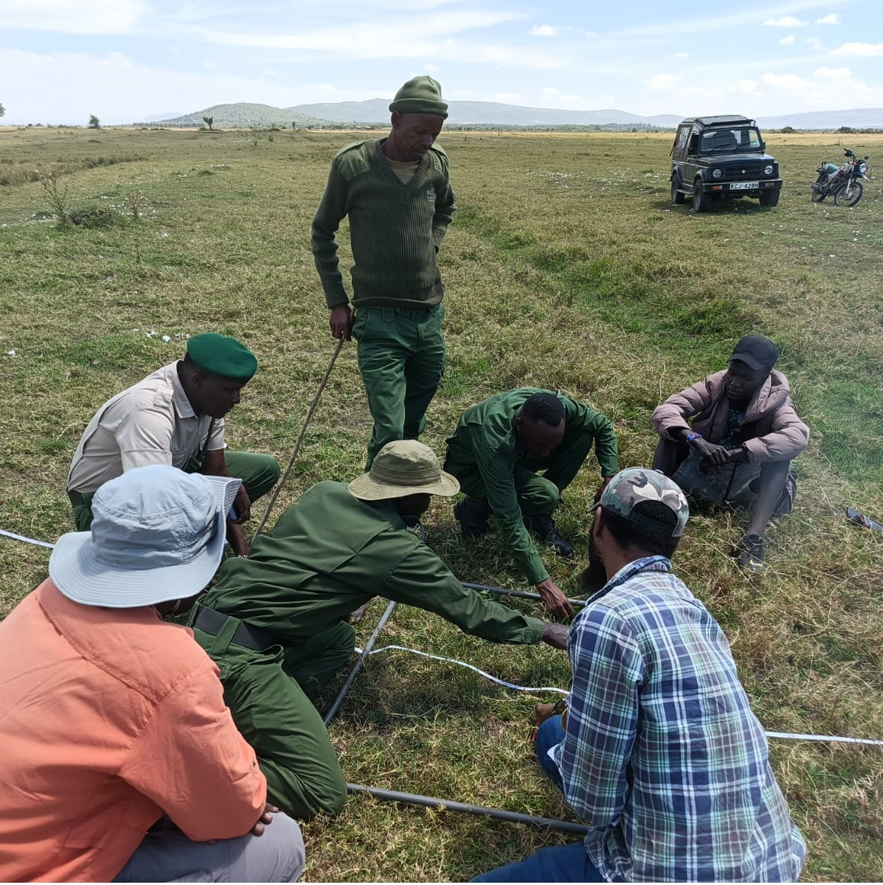
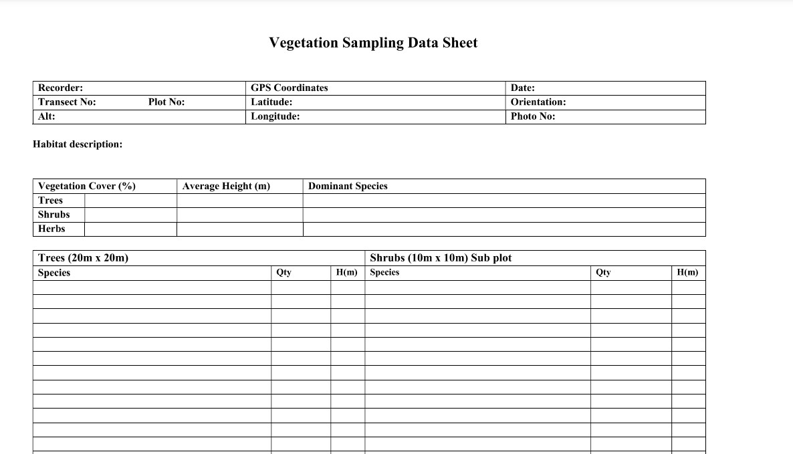

---
title: "**Report on Avian and Plant Species Baseline Survey Conducted in the Northern Mara between 6th to 21st November 2024**"
author: |
  **Authored by:** Milcah C. Kirinyet^1^, Andrew M. Cunliffe^1^, Peter Tyrell^1^  
  **Corresponding Author:** mk767@ex.ac.uk / milcahcherono254@gmail.com
date: "`r Sys.Date()`"
output:
  pdf_document:
    toc: true
    number_sections: true
    fig_caption: true
header-includes:
  - \usepackage{float} # Enables exact figure placement with [H]
  - \setlength{\textfloatsep}{10pt plus 1.0pt minus 2.0pt} # Reduces space around floats
  - \setlength{\floatsep}{10pt plus 1.0pt minus 2.0pt} # Reduces space between floats
  - \setlength{\intextsep}{10pt plus 1.0pt minus 2.0pt} # Fine-tune spacing

---
<style>
h1 {
  text-align: center;
}
</style>


\newpage

## Acknowledgements

This survey was conducted in the Northern Mara Conservancies by the following team: Oppenheimer Impact Scholar, Ms Milcah Kirinyet; Ornithologist, Mr John Musina; and Botanist, Mr Thomas Mwadime Nyange. The team received invaluable support from the Northern Mara Conservancies' management team and rangers, whose dedication and expertise greatly contributed to the success of this project.

We would like to express our gratitude to the Oppenheimer Programme in African Landscapes (OPALS) for providing the funding that made this project possible. Their commitment to advancing conservation and sustainable land use initiatives in Africa is deeply appreciated.


## Executive Summary 

 A comprehensive survey was conducted to establish baseline data on avian and floral species composition within the Northern Mara Conservancies. The survey aimed to provide a foundational understanding of biodiversity in the region, guiding conservation efforts and land use planning. This report presents key findings derived from the data collected.
 
Preliminary findings :

## Background
The Northern Mara Conservancies (Enonkishu, Olchoro Oirouwa, and Mbokishi) collectively span approximately 32,928 acres, forming critical ecological zones  within the larger Mara-Serengeti ecosystem, renowned for its rich biodiversity and complex ecological interactions. These areas serve as a vital interface between biodiversity conservation and community-based land management, demonstrating how sustainable practices can foster coexistence between wildlife and human activities. 

Recent studies have further underscored the pivotal role of community conservancies in preserving wildlife populations within this region. Notably, a 2021 census by the Wildlife Research and Training Institute and the Kenya Wildlife Service revealed that over 83% of wildlife in the Maasai Mara were found in community conservancies. This finding highlights the growing importance of these areas as key players in biodiversity conservation and sustainable land management.

While these conservancies are recognized for their contributions to wildlife conservation, knowledge about other critical aspects of biodiversity remains limited. The avifauna of the Greater Mara Region is relatively well documented within the Maasai Mara National Reserve, but knowledge about bird species in the surrounding conservancies is sparse. For instance, a study conducted by Monadjem and Virani in 2016  recorded 220 bird species at Mara Naboisho but noted that many species' distributions and habitat associations are poorly understood, relying heavily on anecdotal evidence rather than systematic surveys. Although there are basic species lists available for the region, many of these lists do not capture the full complexity of avian and floral diversity across different habitats within the conservancies. This lack of detailed data can hinder effective conservation strategies and management practices.

The recent baseline survey is particularly timely and significant for newer conservancies like Mbokishi that have not yet undergone extensive ecological assessments, further contributing to the data gap. This survey provides an essential opportunity to establish baseline data on its biodiversity, particularly focusing on avian and plant species, while considering the vital role of habitat in shaping the distribution and abundance of bird species.

This baseline survey builds upon the foundational work initiated by Biosphere Expeditions during their 2020 survey in Enonkishu (Lee _et al_., 2020). That study documented over 230 bird species using the Southern African Bird Atlas Project (SABAP2) protocol, underscoring Enonkishu's role as a habitat for various avian populations, including endangered and migratory species. The findings emphasised the necessity for systematic monitoring to understand bird population dynamics and their interactions with land use patterns. The Biosphere Expeditions report from Enonkishu emphasised the critical need for systematic monitoring to better understand bird populations and their interactions with land use patterns. This indicates a broader gap in ecological data across the conservancies.

The Biosphere Expeditions report also laid the groundwork for understanding plant biodiversity through preliminary inventories. It highlighted the importance of grasslands and woodlands in sustaining habitat quality for both wildlife and livestock while revealing significant gaps in data regarding plant species composition, grassland health, and the prevalence of invasive species. 

By creating a structured framework for data collection, our survey addresses gaps identified in earlier research and recommendations to extend surveys to cover a larger geographical area, ensuring that future studies can compare data over time and assess trends effectively. Continuous monitoring through these transects is vital for assessing the health and resilience of the ecosystems within the conservancies. Long-term data will provide insights into species abundance, diversity, and habitat conditions, which are essential for informed conservation strategies and land management practices.


## Introduction
The objectives of this survey were:

*	Establish a comprehensive biomonitoring baseline for avian and floral species composition in the Northern Mara Conservancies
*	Optimise and expand the existing monitoring infrastructure, integrating bird and plant species alongside the ongoing mammal monitoring.
*	Enhance local capacity to sustain ongoing biodiversity monitoring through training and knowledge transfer.
*	Align monitoring efforts with international standards and best practices for biodiversity monitoring and assessment.

We organised introductory sessions in Enonkishu (for both the Enonkishu and Mbokishi teams) and the Olchoro Oirouwa team at their office headquarters, to discuss the objectives of our visit and the importance of biodiversity surveys for the conservancies and develop the support of the teams and their participation in the planned activities. 

## Habitat Mapping and Site Selection for Biodiversity Monitoring

### Habitat Stratification and Mapping

To ensure representative coverage of diverse habitats, the study area within the Northern Mara Conservancies was systematically stratified. Habitats were categorised into distinct types, including grasslands, shrublands, woodlands, and wetlands. Each stratum was treated as an independent unit for sampling. This stratified approach facilitated targeted data collection, ensuring that each habitat type was adequately represented in the study.

To map habitat types within the conservancies, we employed a combination of Google Earth Engine (GEE) and QGIS for data analysis and classification. The process began with the delineation of the area of interest (AOI), which encompassed the conservancies and an additional buffer zone. The buffer zone was incorporated to account for transitional land uses and edge effects, thus capturing a holistic picture of the landscape.

Landsat 8 Surface Reflectance imagery for the year 2023 was filtered to the AOI and a specific date range, ensuring temporal relevance and spatial accuracy. A cloud masking algorithm was applied to exclude pixels impacted by clouds and shadows, further enhancing the data quality. Vegetation indices, including the Normalized Difference Vegetation Index (NDVI) and Enhanced Vegetation Index (EVI), were calculated to improve the differentiation of land cover types.

To classify the habitat types, training data was prepared by merging feature collections that represented key habitats such as water, woodland, grassland, and shrubland. A Random Forest classifier was employed to classify the AOI, including the buffer zone, using spectral bands and vegetation indices. Model accuracy was validated through a split of training and testing datasets, ensuring reliability and robustness of the results. The final classified map was exported from GEE at a resolution of 30 meters.

Further refinements were conducted in QGIS. The map's colour scheme was optimised to visually distinguish habitat types, and essential elements such as labels and legends were added to enhance clarity. The inclusion of the buffer zone provided critical insights into transitional landscapes surrounding the conservancies. This final map serves as a foundational resource for understanding habitat dynamics, guiding conservation planning, and informing land use decisions both within and beyond the conservancies.




### Survey Site Selection

Within the classified habitat strata, stratified random sampling was used to identify survey sites. This method ensured that key ecological features across habitat types were adequately represented, establishing a robust framework for biodiversity assessments. Sampling sites were further refined using Google Earth Pro to pinpoint and mark precise locations for sampling points and transects across the landscape.

Monitoring sites were selected based on predefined criteria, ensuring comprehensive coverage of the ecological diversity within the conservancies. For bird surveys, line transects of approximately 3 kilometres were established for each habitat type, with at least two sites per habitat type in each conservancy. For vegetation monitoring, 1-kilometre transects were designed for each habitat type to adequately capture ecological variations across the landscape.

The refinement of site selection and monitoring strategies was significantly enhanced through close collaboration with local experts, including Albert Cheruiyot and Dapash Francis. Their extensive knowledge of the region’s habitats was instrumental in capturing the ecological complexity and ensuring the accessibility of monitoring sites. This collaborative effort also facilitated the integration of ground truth data, reinforcing the spatial accuracy and ecological relevance of our sampling strategies.


## Field Surveys

### Avian Metrics (Point counts on line transect method)

We employed point counts along line transects to assess avian diversity and abundance. Transects were established across various habitat types identified during the site selection process to ensure comprehensive coverage of the study area.

```{r, r, echo = FALSE, warning = FALSE, fig.cap = "Transect line with sample points"}
library(ggplot2)

# Define parameters for the transect
start <- 0         
end <- 2400        
spacing <- 200     
mid_point <- 1300  

# Data for labels at intervals along the transect
interval_labels <- data.frame(
  x = seq(start, end, by = spacing),
  y = rep(-0.4, length(seq(start, end, by = spacing))), # Position below the transect
  text = seq(start, end, by = spacing) # Numbers at intervals
)

# Data for key labels (start, midpoint, end)
labels <- data.frame(
  x = c(start, (start + end) / 2, end),
  y = c(0, 0, 0),
  text = c("0 m", "Mid-point", "2400 m")
)

# Create the plot
  ggplot() +
  # Draw the transect line
  geom_segment(aes(x = start, xend = end, y = 0, yend = 0), size = 1.5) +
  
  # Add sample points (tick marks)
  geom_segment(aes(x = seq(start, end, by = spacing), 
                   xend = seq(start, end, by = spacing), 
                   y = -0.2, yend = 0.2), size = 1) +
  
  # Add labels at intervals
  geom_text(data = interval_labels, aes(x = x, y = y, label = text), size = 3.5) +
  
  # Add labels for start, mid-point, and end
  geom_text(data = labels, aes(x = x, y = -0.6, label = text), size = 4) +
  
  # Arrow and label for "Transect Line" (placed at 1300 m, green color)
  geom_segment(aes(x = mid_point, xend = mid_point, y = 0.3, yend = 0), 
               arrow = arrow(length = unit(0.2, "cm")), size = 0.8, color = "green") +
  annotate("text", x = mid_point, y = 0.5, label = "Transect Line", size = 5) +
  
  # Shortened arrow and label for "Sample Points" (diagonally, green color)
  geom_segment(aes(x = start + spacing, xend = start + spacing, y = 0.4, yend = 0.2), 
               arrow = arrow(length = unit(0.2, "cm")), size = 0.8, color = "green") +
  annotate("text", x = start + spacing, y = 0.5, label = "Sample Points", size = 4, 
           angle = 45, hjust = 0) +
  
  # Box around the diagram
  annotate("rect", xmin = start - 100, xmax = end + 100, ymin = -1, ymax = 1, 
           color = "black", fill = NA, size = 1) +
  
  # Minimalist theme
  theme_void() +
  labs(title = " ") +
  theme(plot.title = element_text(hjust = 0.5, size = 14, face = "bold"))


```


#### Materials used

*	Binoculars 
*	Spotting scope and sturdy tripod (for wietlands)
*	Field data sheets and field notebook
*	Clipboard, pencil and eraser
* Large clear plastic bag (envelop) to protect data sheets from rain
* GPS mobile field device/Compass
*	Taxonomic keys including;
      - Photo-Guides
      - Mobile Apps
      - Field Handbooks, especially:
 1. Field Guide to the Birds of Kenya and Northern Tanzania by Dale A. Zimmerman, David J. Pearson & Donald A. 
 2. Birds of East Africa by Terry Stevenson and John Fanshawe.
 
#### Survey Design
Point count stations were located every 200 meters along each transect.
At each station, observers conducted a 10-minute count.
Conducted during peak activity periods:

- Morning: 06:00 - 10:00 hours.
- Afternoon: 16:00 - 18:00 hours.

Surveys avoided adverse weather conditions that could affect bird activity or detectability.GPS coordinates and habitat characteristics were recorded at each point to contextualize findings.

Observations were categorised by species, and counts included all individuals detected.
The point count datasheet facilitated the systematic observation of bird species. Parameters recorded included:

-	Species Presence and Abundance: Number of individuals per species observed within the predefined point count.
-	Time Intervals: Observations were segmented into time intervals of 10 minutes. 
-	Environmental Conditions: Weather data (temperature, wind speed, cloud cover) and time of day were recorded  to contextualize species activity.
-	Habitat Associations: Notes were taken on vegetation or landscape features surrounding the observation point.


\newpage
####  Wetland Total Counts

Given the ecological importance of wetlands as biodiversity hotspots, we employed total counts for all bird species within these habitats. Unlike point counts, this method entailed exhaustive surveys covering the entire wetland area. Observers systematically documented all visible bird species and their respective abundances, supported by binoculars and spotting scopes to improve detection accuracy.This ensured that wetlands were appropriately represented in the overall biodiversity assessment.




- Calculate species richness for each wetland.
- Compare species abundance across wetlands 
- Identify wetland-dependent and conservation-priority species.


#### Opportunistic bird sightings (to build the species list)

\newpage

#### Data collection


#### Data forms

The front page of the Avian Point Count Data Sheet used during the study is shown below:




#### Analysis

##### Avian Abundance and Species Richness

- Total number of bird species observed per habitat type.
- Number of individuals per species divided by the total number of individuals observed.-relative abundance
- Use mean counts per point to estimate population densities by species.
- Identify species strongly associated with specific habitats

##### Rare, Threatened, and Endangered Species


#### Challenges faced : habitat type and elevation

\newpage

### Vegetation Metrics (Quadrats on transect method)

Data on vegetation were recorded to assess habitat structure, species composition, and overall ecosystem health. The parameters collected included:

-	**Species Identification**: Plant species were recorded by their scientific names.
-	Canopy Cover: Estimated as a percentage to understand shading and structural complexity.
-	Tree Height: Estimated for structural profiling.
-	Ground Cover: Percentages of grass, bare soil, and other ground cover types were noted.
Site Descriptions
To provide context for the ecological data, general site parameters were also recorded:

-	Coordinates: Each sampling point’s exact location was recorded.
-	Elevation: Measured using GPS on mobile devices
-	Photographic Evidence: Images of interesting bird species were captured for reference and also quadrats for vegetation samples were captured.
-	Disturbance Indicators: Signs of human activity, grazing, or natural disturbances (e.g., fire) were noted whenever present.

#### Survey Design

Quadrat Dimensions: 20m × 20m
Transect and quadrat locations were determined based on:

- Habitat type
- Accessibility for repeated monitoring.

Species-specific data, including counts and heights for trees and shrubs, and abundance for herbaceous plants
Photographs were taken of each quadrat from standardized angles for visual records.

\newpage

#### Data collection
 
 Discuss the procedure here 
 
 
 



\newpage


#### Data forms


 Highlight major parameters captured by the data form
 
 



## Results/Findings

- Total species counts,A total of xxxx avian species were recorded, xx/xxxx species are of the LC,EN,NT,VU,CR
- Most abundant birds

## Discussion


\newpage

## Training and Capacity Building

To enhance the capacity-building efforts for ground teams, we organised a half -day training for the rangers, to equip the rangers with the necessary skills and knowledge on transect set up  protocols, data and tools used in both avian and plants species monitoring.
During this training, we covered fundamental topics, including:

-	Transect setup: Detailed instructions on how to establish transects for both bird surveys and vegetation monitoring were demonstrated including other methods that were not used in this survey (e.g., mist nets).
-	Identification Skills: Rangers were trained in identifying birds using various features such as size, shape, plumage, sounds, calls, behaviour, and habitat preferences. This skill is vital for accurate identification of species in monitoring and data collection.
-	Guiding Books: Participants were introduced to various reference materials available for bird identification and habitat assessment, enhancing their resources for ongoing learning.
-	An important addition to the training was the linking of monitoring to global standards like IUCN, rangers were taken through how to check the IUCN Red List for assessing the conservation value of species identified in their areas. Understanding the status of species is crucial for prioritising conservation actions and monitoring efforts.

The training underscored the significance of biodiversity monitoring in maintaining healthy ecosystems. By equipping rangers with these skills, we aim to foster a culture of continuous learning and engagement that enhances their effectiveness in conservation work. A list of participants is provided in the appendix for reference.

## Conclusion and Recommendations

- Established monitoring programme will contribute to understanding biodiversity trends and conservation impacts
- Results will be useful for conservation financing tools or initiatives
- Trends will be identified based on ongoing assessments and expert consultations.

## References