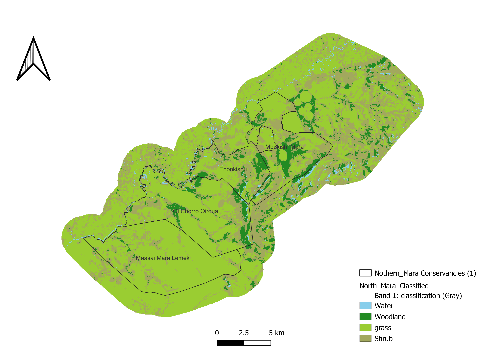

---
title: "**Report on Avian and Plant Species Baseline Survey Conducted in the Northern Mara between 6th to 21st November 2024**"
author: |
  **Authored by:** Milcah C. Kirinyet^1,2^, Andrew M. Cunliffe^1^, Peter Tyrell^2^  
  **Corresponding Author:** mk767@ex.ac.uk / milcahcherono254@gmail.com
date: "`r Sys.Date()`"
output:
  pdf_document:
    toc: true
    number_sections: true
    fig_caption: true
header-includes:
  - \usepackage{float} % Enables exact figure placement with [H]
  - \usepackage{caption} % Required for \captionsetup
  - \setlength{\textfloatsep}{10pt plus 1.0pt minus 2.0pt} % Reduces space around floats
  - \setlength{\floatsep}{10pt plus 1.0pt minus 2.0pt} % Reduces space between floats
  - \setlength{\intextsep}{10pt plus 1.0pt minus 2.0pt} % Fine-tune spacing
  - \setcounter{section}{1} % Ensures section numbering starts at 1
  - \renewcommand\thesection{\arabic{section}} % Formats section numbers as 1,2,3...
  - \captionsetup[figure]{labelsep=period} % Changes "Figure X:" to "Figure X."
---
<style>
h1 {
  text-align: center;
}
</style>


\newpage

\listoftables

\listoffigures

\newpage

## Acknowledgements

We would like to express our gratitude to the Oppenheimer Programme in African Landscapes (OPALS) for providing the funding that made this project possible. Their commitment to advancing conservation and sustainable land use initiatives in Africa is deeply appreciated.

This survey was conducted in the Northern Mara Conservancies by the following team: Oppenheimer Impact Scholar, Ms Milcah Kirinyet; Ornithologist, Mr John Musina; and Botanist, Mr Thomas Mwadime Nyange. The team received invaluable support from the Northern Mara Conservancies' management team and rangers, whose dedication and expertise greatly contributed to the success of this project.

## Executive Summary 

This report  presents a summary of a comprehensive survey that was conducted in the Northern Mara Conservancies to establish baseline data on avian and floral species composition. The survey aimed to provide a foundational understanding of biodiversity in the region, guiding conservation efforts and land use planning. This report presents key findings derived from the data collected.
 
A total of 412 floral species were recorded across the three conservancies, with Mbokishi having the highest diversity at 310, followed by Enonkishu with 203 species, and Olchoro with 196 species.A total of 384 are indigenous and 28 are exotic which represents a small fraction of the total flora which are either naturalized, introduced ornamentals or alien invasive species. Eight invasive plants were recorded during the survey. Plant species included in IUCN Red list and CITES database were considered as species of conservation priority in this survey.

We recorded one hundred and eighty-seven (187) species of birds from 54 families,twelve (12) species were listed as threatened in the IUCN Red List.Two species of vultures, Ruppell’s Griffon Vulture *Gyps rueppellii* and White-backed Griffon Vulture *Gyps africanus* classified as **Critically Endangered**.  Six (6) species including Secretarybird *Sagittarius serpentarius* and Grey Crowned Crane *Balearica regulorum* classified as **Endangered**.  One (1) species, Tawny Eagle *Aquila rapax* classified as **Vulnerable** and two (2) species, Crowned Eagle *Stephanoaetus coronatus* and Eurasian Roller *Coracias garrulus* classified as **Near Threatened**.

## Background

The Northern Mara Conservancies (Enonkishu, Olchoro Oirouwa, and Mbokishi) collectively span approximately 32,928 acres, forming critical ecological zones  within the larger Mara-Serengeti ecosystem, renowned for its rich biodiversity and complex ecological interactions. These areas serve as a vital interface between biodiversity conservation and community-based land management, demonstrating how sustainable practices can foster coexistence between wildlife and human activities. 

Recent studies have further underscored the pivotal role of community conservancies in preserving wildlife populations within this region. A 2021 census revealed that over 80% of wildlife in the Maasai Mara were found in community conservancies, highlighting the growing importance of these areas as key players in biodiversity conservation and sustainable land management (Wildlife Research & Training Institute & Kenya Wildlife Service, 2021).

While these conservancies are recognized for their contributions to wildlife conservation, knowledge about other critical aspects of biodiversity remains limited. The avifauna of the Greater Mara Region is relatively well documented within the Maasai Mara National Reserve but knowledge about bird species in the surrounding conservancies is sparse. For instance, a 2016 study recorded 220 bird species at Mara Naboisho but noted that many species’ distributions and habitat associations remain poorly understood, relying heavily on anecdotal evidence rather than systematic surveys (Monadjem & Virani, 2016). Although there are basic species lists available for the region, many of these lists do not capture the full complexity of avian and floral diversity across different habitats within the conservancies. This lack of detailed data can hinder effective conservation strategies and management practices.

The recent baseline survey is particularly timely and significant for newer conservancies like Mbokishi that have not yet undergone extensive ecological assessments, further contributing to the data gap. This survey provides an essential opportunity to establish baseline data on its biodiversity, particularly focusing on avian and plant species, while considering the vital role of habitat in shaping the distribution and abundance of bird species.

\newpage

This baseline survey builds upon the foundational work initiated by Biosphere Expeditions during their 2020 survey in Enonkishu (Lee et al., 2020). That study documented over 230 bird species using the Southern African Bird Atlas Project (SABAP2) protocol, underscoring Enonkishu's role as a habitat for various avian populations, including endangered and migratory species. The findings emphasised the necessity for systematic monitoring to understand bird population dynamics and their interactions with land use patterns. The Biosphere Expeditions report from Enonkishu emphasised the critical need for systematic monitoring to better understand bird populations and their interactions with land use patterns. This indicates a broader gap in ecological data across the conservancies.

The Biosphere Expeditions report also laid the groundwork for understanding plant biodiversity through preliminary inventories. It highlighted the importance of grasslands and woodlands in sustaining habitat quality for both wildlife and livestock while revealing significant gaps in data regarding plant species composition, grassland health, and the prevalence of invasive species. 

By creating a structured framework for data collection, our survey addresses gaps identified in earlier research and recommendations to extend surveys to cover a larger geographical area, ensuring that future studies can compare data over time and assess trends effectively. Continuous monitoring through these transects is vital for assessing the health and resilience of the ecosystems within the conservancies. Long-term data will provide insights into species abundance, diversity, and habitat conditions, which are essential for informed conservation strategies and land management practices.

Central to the success and sustainability of this monitoring effort is capacity building, ensuring that local stakeholders are equipped with the necessary skills and knowledge to carry out long-term biodiversity monitoring independently. By fostering expertise in data collection, management, and interpretation, we strengthen local engagement and ownership of conservation efforts. This investment in skills development not only enhances the quality and reliability of ecological data but also ensures that monitoring remains an ongoing, community-driven process that supports adaptive conservation and land management strategies well into the future.

## Introduction

The objectives of this survey were:

*	Establish a comprehensive biomonitoring baseline for avian and floral species composition in the Northern Mara Conservancies
*	Optimise and expand the existing monitoring infrastructure, integrating bird and plant species alongside the ongoing mammal monitoring.
*	Enhance local capacity to sustain ongoing biodiversity monitoring through training and knowledge transfer,incorporating the latest best practices in data management. This includes implementing robust data analysis workflows, ensuring reproducibility, transparency, and efficiency.
*	Align monitoring efforts with international standards and best practices for biodiversity monitoring and assessment.

We organised introductory sessions in Enonkishu (for both the Enonkishu and Mbokishi teams) and the Olchoro Oirouwa team at their office headquarters, to discuss the objectives of our visit and the importance of biodiversity surveys for the conservancies and develop the support of the teams and their participation in the planned activities. 

## Habitat Mapping and Site Selection for Biodiversity Monitoring

### Habitat Stratification and Mapping

To ensure representative coverage of diverse habitats, the study area within the Northern Mara Conservancies was systematically stratified. Habitats were categorised into distinct types, including grasslands, shrublands, woodlands, and wetlands. Each stratum was treated as an independent unit for sampling. This stratified approach facilitated targeted data collection, ensuring that each habitat type was adequately represented in the study.

To map habitat types within the conservancies, we employed a combination of Google Earth Engine (GEE) and QGIS for data analysis and classification. The process began with the delineation of the area of interest (AOI), which encompassed the conservancies and an additional buffer zone. The buffer zone was incorporated to account for transitional land uses and edge effects, thus capturing a holistic picture of the landscape.

Landsat 8 Surface Reflectance imagery for the year 2023 was filtered to the AOI. To minimize noise from temporal variability, a median composite was generated, ensuring a representative snapshot of habitat conditions across the year.A cloud masking algorithm was applied to exclude pixels impacted by clouds and shadows, further enhancing the data quality.  Vegetation indices, including the Normalized Difference Vegetation Index (NDVI) and Enhanced Vegetation Index (EVI), were calculated to improve the differentiation of land cover types.

To classify the habitat types, training data was prepared by merging feature collections that represented key habitats such as water, woodland, grassland, and shrubland. A Random Forest classifier was employed to classify the AOI, including the buffer zone, using spectral bands and vegetation indices. Model accuracy was validated through a split of training and testing datasets, ensuring reliability and robustness of the results. The final classified map was exported from GEE at a spatial resolution of 30 meters.

Further cartographic refinements, including symbology adjustments, legend additions, and layout enhancements, were implemented in QGIS to improve map readability and interpretation. The inclusion of the buffer zone provided insights into transitional landscapes surrounding the conservancies. This final map serves as a foundational resource for understanding habitat dynamics, guiding conservation planning, and informing land use decisions both within and beyond the conservancies.



\newpage

### Survey Site Selection

Within the classified habitat strata, stratified random sampling was used to identify survey sites. This method ensured that key ecological features across habitat types were adequately represented, establishing a robust framework for biodiversity assessments. Sampling sites were further refined using Google Earth Pro to pinpoint and mark precise locations for sampling points and transects across the landscape.

Monitoring sites were selected based on predefined criteria, ensuring comprehensive coverage of the ecological diversity within the conservancies. For bird surveys, line transects of approximately three kilometres were established for each habitat type, with at least two sites per habitat type in each conservancy. For vegetation monitoring, 1-kilometre transects were designed for each habitat type to adequately capture ecological variations across the landscape.

The refinement of site selection and monitoring strategies was significantly enhanced through close collaboration with local experts, including Albert Cheruiyot and Dapash Francis. Their extensive knowledge of the region’s habitats was instrumental in capturing the ecological complexity and ensuring the accessibility of monitoring sites. This collaborative effort also facilitated the integration of ground truth data, reinforcing the spatial accuracy and ecological relevance of our sampling strategies.


## Field Surveys

### Avian Metrics (Point counts on line transect method)

We used Point Counts on Line Transects to estimate the relative abundance and species diversity in three representative habitats namely; grassland, shrubland and forest.  We also recorded opportunistic sightings to augment the species list of the general ecosystem.

```{r, r, echo = FALSE, warning = FALSE, fig.cap = "Transect line with sample points"}
library(ggplot2)

# Define parameters for the transect
start <- 0         
end <- 2400        
spacing <- 200     
mid_point <- 1300  

# Data for labels at intervals along the transect
interval_labels <- data.frame(
  x = seq(start, end, by = spacing),
  y = rep(-0.4, length(seq(start, end, by = spacing))), # Position below the transect
  text = seq(start, end, by = spacing) # Numbers at intervals
)

# Data for key labels (start, midpoint, end)
labels <- data.frame(
  x = c(start, (start + end) / 2, end),
  y = c(0, 0, 0),
  text = c("0 m", "Mid-point", "2400 m")
)

# Create the plot
  ggplot() +
  # Draw the transect line
  geom_segment(aes(x = start, xend = end, y = 0, yend = 0), size = 1.5) +
  
  # Add sample points (tick marks)
  geom_segment(aes(x = seq(start, end, by = spacing), 
                   xend = seq(start, end, by = spacing), 
                   y = -0.2, yend = 0.2), size = 1) +
  
  # Add labels at intervals
  geom_text(data = interval_labels, aes(x = x, y = y, label = text), size = 3.5) +
  
  # Add labels for start, mid-point, and end
  geom_text(data = labels, aes(x = x, y = -0.6, label = text), size = 4) +
  
  # Arrow and label for "Transect Line" (placed at 1300 m, green color)
  geom_segment(aes(x = mid_point, xend = mid_point, y = 0.3, yend = 0), 
               arrow = arrow(length = unit(0.2, "cm")), size = 0.8, color = "green") +
  annotate("text", x = mid_point, y = 0.5, label = "Transect Line", size = 5) +
  
  # Shortened arrow and label for "Sample Points" (diagonally, green color)
  geom_segment(aes(x = start + spacing, xend = start + spacing, y = 0.4, yend = 0.2), 
               arrow = arrow(length = unit(0.2, "cm")), size = 0.8, color = "green") +
  annotate("text", x = start + spacing, y = 0.5, label = "Sample Points", size = 4, 
           angle = 45, hjust = 0) +
  
  # Box around the diagram
  annotate("rect", xmin = start - 100, xmax = end + 100, ymin = -1, ymax = 1, 
           color = "black", fill = NA, size = 1) +
  
  # Minimalist theme
  theme_void() +
  labs(title = " ") +
  theme(plot.title = element_text(hjust = 0.5, size = 14, face = "bold"))


```

#### Materials used

*	Binoculars 
*	Spotting scope and sturdy tripod (for wietlands)
*	Field data sheets and field notebook
*	Clipboard, pencil and eraser
* Large clear plastic bag (envelop) to protect data sheets from rain
* GPS mobile field device/Compass
*	Taxonomic keys including;
      - Photo-Guides
      - Mobile Apps
      - Field Handbooks, especially:
 1. Field Guide to the Birds of Kenya and Northern Tanzania by Dale A. Zimmerman, David J. Pearson & Donald A. 
 2. Birds of East Africa by Terry Stevenson and John Fanshawe.
 
#### Survey Design

Point count stations were located every 200 meters along each transect.
At each station, observers conducted a 10-minute count.
Conducted during peak activity periods:

- Morning: 06:00 - 10:00 hours.
- Afternoon: 16:00 - 18:00 hours.

Surveys avoided adverse weather conditions that could affect bird activity or detectability.GPS coordinates and habitat characteristics were recorded at each point to contextualize findings.

Observations were categorised by species, and counts included all individuals detected.
The point count datasheet facilitated the systematic observation of bird species. Parameters recorded included:

-	Species Presence and Abundance: Number of individuals per species observed within the predefined point count.
-	Time Intervals: Observations were segmented into time intervals of 10 minutes. 
-	Environmental Conditions: Weather data (temperature, wind speed, cloud cover) and time of day were recorded  to contextualize species activity.
-	Habitat Associations: Notes were taken on vegetation or landscape features surrounding the observation point.


\newpage

####  Wetland Total Counts

Given the ecological importance of wetlands as biodiversity hotspots, we employed total counts for all bird species within these habitats. Unlike point counts, this method entailed exhaustive surveys covering the entire wetland area. Observers systematically documented all visible bird species and their respective abundances, supported by binoculars and spotting scopes to improve detection accuracy.This ensured that wetlands were appropriately represented in the overall biodiversity assessment.


\begin{figure}[h!]
\centering
\begin{tabular}{cc}
\includegraphics[width=0.45\textwidth]{images/wetland-observation.jpeg} &
\includegraphics[width=0.45\textwidth]{images/wetland.JPG} \\
\end{tabular}
\caption{Sample images taken during observations in wetland areas. }
\end{figure}

- Calculate species richness for each wetland.
- Compare species abundance across wetlands 
- Identify wetland-dependent and conservation-priority species.

\newpage

#### Opportunistic bird sightings (to build the species list)


#### Data collection


#### Analysis

##### Avian Abundance and Species Richness

- Total number of bird species observed per habitat type.
- Number of individuals per species divided by the total number of individuals observed.-relative abundance
- Use mean counts per point to estimate population densities by species.
- Identify species strongly associated with specific habitats

##### Rare, Threatened, and Endangered Species

#### Challenges faced : habitat type and elevation

\newpage

## Vegetation Metrics 

### Vegetation classification 

The study area’s plant cover is predominantly secondary in nature and consists of three main 
vegetation types namely; shrubland, grassland and forest, other microhabitats include different
wetland types such as seasonal and permanent water pools/marsh and seepages. 

#### Shrubland

The study area comprise of three main shrubland types namely; Semi-evergreen shrubland
dominated by *Tarchonanthus camphoratus*, *Psiadia punctulata*, *Euclea spp.*, *Croton dichogamus* 
and *Searsia crenulata* that is edaphically restricted to rocky hill slopes and grassy hill bases and generally representing the climax vegetation. Secondary evergreen shrubland dominated with 
*Euclea divinorum* is the vegetation type that forms the ecotone between upland evergreen dry 
forest patches and open grasslands, *Croton dichogamus* dominated semi-evergreen 
shrubland/thicket forming at edges of *Tarchonanthus* shrubland and upland dry forest is a sign of 
high degradation. All these habitats had variations in species composition observed at different sample points, these variations were greatly influenced by edaphic, climate, weather (Abiotic factors) and human, livestock and wildlife (Biotic factors). 

#### Grassland 

Grasslands consist of vast areas dominated mainly by grass and in our study area are generally 
secondary in nature due to past human interference mainly for settlement, crop land and 
livestock pasture lands and also co-existing with wildlife. Variations in species composition was 
observed at different sampling areas resulting in four categories of grassland types namely; 
wooded grassland with *Balanites aegyptiaca* as the dominant trees, bushed grassland with 
*Euclea divinorum* or *Tarchonanthus* as the main bushes, open scattered tree grassland with 
*Balanites aegyptiaca* and *Vachellia gerrardii*  as the main trees while *Sporobolus pyramidalis* and 
*Themeda triandra* as dominant grass species and “fallow land” is a secondary grassland type 
represented by the recently abandoned croplands for the purpose of wildlife conservation with 
very short grass and consist of overgrazed land dominated with *Chloris pycnothrix*, *Cynodon 
dactylon*, *Digitaria abyssinica*, *Trifolium semipilosum*, *Solanum campylacanthum* and 
*Dyschoriste radicans* and many naturalized exotic weed species.

#### Forest 

This vegetation type consists of an assemblage of trees with a continuous interlocking canopy 
and constitutes about 10-20% percent of the study area. This plant community was identified as Upland evergreen dry forest and is mainly dominated by *Diospyros abyssinica*, 
*Euclea divinorum* and *Warburgia ugandensis* as the upper canopy species while *Croton 
dichogamus* as the dominant understory shrub, variations in species composition was observed 
with increase in moisture and edaphic factors. The moistier type consisted of *Diospyros 
abyssinica* and *Warburgia ugandensis* as the dominant upper canopy species with *Justicia spp.* as 
the under story herb species while the much drier type consisted of *Olea* and *Diospyros* as 
dominant upper canopy species and *Hypoestes forskaolii* and *Setaria megaphylla*   as the 
dominant herbaceous species. 

#### Wetlands 

These are permanently or seasonally wet grounds that constitute plant assemblages with unique 
plants that are adapted to waterlogged environments. These form part of the microhabitats that 
include different wetland types such as seasonal and permanent water pools/marsh, man-made 
dams and seepages. 

### Survey Design

Plant diversity documentation entailed establishment of 1 km line transects, each containing five sampling plots measuring 20 x 20 meters, spaced 250 m apart from their center points. This resulted in a total of 55 sampling plots within the conservancies and an additional four control plots outside the conservancies. The transects were distributed as follows: three in Enonkishu, four in Mbokishi, and four in Olchoro conservancies. In addition to these, specific microhabitats such as wetlands were targeted for sampling, where five wetlands were surveyed without establishing fixed plots.

Tree sampling included identifying and counting all trees within the 20 x 20 m plots, along with estimating canopy cover and tree height. Shrubs were sampled within one 10 x 10 m subplot nested in the larger plot, while herbaceous plants were sampled using four 1 x 1 m quadrats. The sampling plots captured data on plant species diversity, composition, and abundance, including records of dominant trees, shrubs, and herbs, individual species counts, and estimates of average height and cover. These attributes were used to classify different vegetation types.

Additional plant documentation was conducted outside the established sample plots to provide a comprehensive understanding of the ecosystem. A handheld GPS was used to georeference all sample plots/points and record elevation. Species of conservation concern, including rare and threatened plants, were identified using information from the International Union for Conservation of Nature (IUCN) and the Convention on International Trade in Endangered Species (CITES) databases. Photographs were taken for further identification and reporting, and plant specimens were collected for identification and preservation at the East African Herbarium.


\newpage


\newpage

## Results/Findings

### Floral Species diversity and composition

A total of 412 plant species belonging to 71 families and 268 genera were recorded during the
survey. Out of the total species recorded 384 were indigenous and 28 were exotic including
naturalized weeds, invasive, introduced ornamentals or hedge plants. Poaceae (Grass family) had
the highest diversity with 63 species followed by Asteraceae (Sunflower family) with with 46
species, Fabaceae (Legume family) with 43 species, Acanthaceae (Acanthus family) with 25 and
Malvaceae (Cotton family) with 21 species, all the five families representing about 48% of the
total species. The genus *Cyperus* was the most diverse with 13 species then followed by *Indigofera* with 9 species, then *Vachellia* and *Eragrostis* both with 8 species each. 

```{r floral-habit-stacked-bar, echo=FALSE, warning=FALSE, fig.cap="Floral Habit Diversity as a Percentage."}
# Load required library
library(ggplot2)

# Define the data
data <- data.frame(
  Habit = factor(c("Trees", "Shrubs", "Herbs", "Climbers"), 
                 levels = rev(c("Herbs", "Shrubs", "Trees", "Climbers"))), # Reverse order so Herbs is at the base
  Percentage = c(11, 11, 67, 11)
)

# Define custom colors
colors <- c("Herbs" = "#ADFF2F", "Shrubs" = "#8B4513", 
            "Trees" = "#228B22", "Climbers" = "#6A5ACD")

# Create a stacked bar plot
ggplot(data, aes(x = "", y = Percentage, fill = Habit)) +
  geom_bar(stat = "identity", width = 1) +  # Stacked bar
  scale_fill_manual(values = colors) +  # Apply custom colors
  labs(x = NULL, y = "Percentage", fill = "Floral Habit") +
  ggtitle(" ") +
  theme_minimal() +
  theme(axis.text.x = element_blank(),  # Hide x-axis text
        axis.ticks.x = element_blank()) # Hide x-axis ticks

```

\newpage

### Invasive species 

These are introduced non-native or native plants that adversely affect the habitats they invade economically, environmentally and ecologically. Eight invasive plants were recorded during the 
survey.

\begin{table}[H]
\centering
\caption{List of Invasive Species and Their Habit}
\begin{tabular}{l l l}
\hline
\textbf{Family} & \textbf{Species} & \textbf{Habit} \\ \hline
Asteraceae & \textit{Parthenium hysterophorus} L. & Herb \\ 
Asteraceae & \textit{Senecio madagascariensis} Poir. & Herb \\ 
Asteraceae & \textit{Xanthium strumarium} L. & Herb \\ 
Cactaceae & \textit{Austrocylindropuntia subulata} (Muehlenpf.) Backeb. & Shrub \\ 
Cactaceae & \textit{Opuntia ficus-indica} (L.) Mill. & Shrub \\ 
Fabaceae & \textit{Caesalpinia decapetala} (Roth) Alston & Shrub \\ 
Solanaceae & \textit{Datura stramonium} L. & Herb \\ 
Verbenaceae & \textit{Lantana camara} L. & Shrub \\ \hline
\end{tabular}
\end{table}


\begin{figure}[h!]
\centering
\begin{tabular}{cc}
\includegraphics[width=0.4\textwidth]{images/invasive01.JPG} &
\includegraphics[width=0.4\textwidth]{images/invasive02.JPG} \\
\includegraphics[width=0.4\textwidth]{images/invasive03.JPG} &
\includegraphics[width=0.4\textwidth]{images/invasive04.JPG} \\
\end{tabular}
\caption{Images of invasive species observed during the Northern Mara biodiversity survey.}
\end{figure}

\newpage

### Species of Conservation Concern

This section documents species identified during the survey that are listed under globally recognized conservation frameworks, namely the IUCN Red List and CITES Appendices.

\begin{table}[H]
\centering
\caption{List of IUCN Red List Species, Their Habits, and Respective Categories}
\begin{tabular}{l l l l}
\hline
\textbf{Family} & \textbf{Species} & \textbf{Habit} & \textbf{IUCN Category} \\ \hline
Asphodelaceae & \textit{Aloe lateritia Engl. var. graminicola} & Herb & Least Concern (LC) \\ 
Asphodelaceae & \textit{Aloe volkensii Engl. ssp. multicaulis} & Tree & Least Concern (LC) \\ 
Euphorbiaceae & \textit{Euphorbia bicompacta Bruyns var. bicompacta} & Tree & Least Concern (LC) \\ 
Euphorbiaceae & \textit{Euphorbia candelabrum Kotschy} & Tree & Least Concern (LC) \\ 
Euphorbiaceae & \textit{Euphorbia magnicapsula S.Carter var. magnicapsula} & Tree & Near Threatened (NT) \\ 
Santalaceae & \textit{Osyris lanceolata Hochst. \& Steud.} & Shrub & Least Concern (LC) \\ \hline
\end{tabular}
\end{table}


- Six species recorded during the survey fall under the Least Concern (LC) and Near Threatened (NT) categories (Table 2).
- *Euphorbia magnicapsula var. magnicapsula*, categorized as NT, requires attention due to its proximity to higher risk levels of extinction.

\begin{figure}[H]
\centering
\begin{tabular}{cc}
\includegraphics[width=0.45\textwidth]{images/iucn01.JPG} &
\includegraphics[width=0.45\textwidth]{images/iucn02.JPG} \\
\end{tabular}
\caption{From left; \textit{Aloe lateritia var. graminicola} and \textit{Euphorbia magnicapsula var. magnicapsula}, both species listed under the IUCN Red List.}
\end{figure}

\newpage

\begin{table}[H]
\centering
\caption{List of CITES Species, Their Habits, and Categories}
\begin{tabular}{l l l l}
\hline
\textbf{Family} & \textbf{Species} & \textbf{Habit} & \textbf{CITES Appendix} \\ \hline
Asphodelaceae & \textit{Aloe lateritia Engl. var. graminicola} & Herb & Appendix II \\ 
Asphodelaceae & \textit{Aloe volkensii Engl. ssp. multicaulis} & Tree & Appendix II \\ 
Euphorbiaceae & \textit{Euphorbia candelabrum Kotschy} & Tree & Appendix II \\ 
Euphorbiaceae & \textit{Euphorbia magnicapsula S.Carter var. magnicapsula} & Tree & Appendix II \\ 
Orchidaceae & \textit{Aerangis confusa J.Stewart} & Herb & Appendix II \\ 
Orchidaceae & \textit{Aerangis luteoalba (Kraenzl.) Schltr. var. rhodosticta} & Herb & Appendix II \\ 
Orchidaceae & \textit{Cyrtorchis praetermissa Summerh.} & Herb & Appendix II \\ 
Santalaceae & \textit{Osyris lanceolata Hochst. \& Steud.} & Shrub & Appendix II \\ \hline
\end{tabular}
\end{table}


- Eight species recorded are included in Appendix II, indicating the need for regulated trade to prevent their overexploitation (Table 3).
- Notable examples include *Osyris lanceolata*, which faces pressures from commercial harvesting, and orchids like *Aerangis confusa*, known for their ornamental value.

\begin{figure}[H]
\centering
\begin{tabular}{cc}
\includegraphics[width=0.45\textwidth]{images/cites01.JPG} &
\includegraphics[width=0.45\textwidth]{images/cites02.jpg} \\
\end{tabular}
\caption{From left; \textit{Aerangis confusa}, an epiphytic orchid, and \textit{Osyris lanceolata} (African Sandalwood), species protected under CITES Appendix II.}
\end{figure}

\newpage

### Threats to the vegetation

- Past clearing of indigenous forest to pave way for development was observed at Mbokish
Conservancy settlement area and was evident due to presence of several tree stamps of
*Olea europaea* and secondary bushes dominated by *Croton dichogamus* and *Euclea spp.*
- Overgrazing by livestock was evident at Mbokishi conservancy settlement areas near
bomas as indicated by the relatively high proportion of bare ground observed.
- Improper disposal and introduction exotic hedge plants without expert consultation is
leading to invasion into the natural vegetation thus interfering with the native species
composition was observed at Enonkishu conservancy.
- Invasion of by the alien invasive species such as *Parthenium hysperophorus* and *Lantana
camara* was observed.

\begin{figure}[h!]
\centering
\begin{tabular}{cc}
\includegraphics[width=0.45\textwidth]{images/tree-stamps.jpeg} &
\includegraphics[width=0.45\textwidth]{images/invasive04.JPG} \\
\end{tabular}
\caption{Tree stumps evidencing past clearing of indigenous forest (left) and invasive species observed (right).}
\end{figure}


#### Discussion

A total of 412 species were recorded during the survey and is quite impressive in relation to its size. A total of 384 are indigenous and 28 are exotic which represents a small fraction of the total flora which are either naturalized, introduced ornamentals or alien invasive species 
constituted less than 10% of the total plants recorded. The plant diversity is considered 
significant despite the fact that most of the study area has undergone some habitat degradation. 

Mbokishi had highest diversity due to most of its vegetation is secondary in nature especially 
recently abandoned cropland with very high diversity of naturalized exotic weeds, the permanent wetland at Chali Chali base camp also highly contributed to its diversity where as Enonkishu and Olchoro had great similarity with more homogenous old grasslands, with shrublands and forests forming climax vegetation. Poaceae (Grass family) had the highest diversity with 63 species followed Asteraceae (Sunflower family) with 46 species then Fabaceae (Legume family) by with 43 species, Acanthaceae (Acanthus family) with 25 species and Malvaceae (Cotton family) with 21 species, all the five families representing about 48% of the total species and thus playing a very important role in understanding the role they play in this important ecosystems and adjacent environs. The vegetation diversity and composition across most of the habitats sampled was highly dependent on human interference, most of the present vegetation is as result of secondary regeneration after the original forests were cleared to pave way for settlement, crop cultivation and livestock keeping. Its vegetation is host to several CITES species and its preservation will ensure protection of these important species of flora and fauna it hosts and the entire ecosystem.  The established sample plots will be used to monitor plants diversity and composition dynamics over time.

### Recommendations

- Controlled development in the conservancies to reduce damage to vegetation.
- Proper disposal of exotic hedge plants to avoid invasion into the natural habitat by
uprooting and incineration.
- Reduce introduction of exotic ornamental species by using indigenous plants for
landscaping which should be guided by plant experts.
- Manage the spread of invasive species such as *Lantana camara* (Tick Berry) by physical
removal.


### Conclusion

The areas plant diversity is highly dependent on human intervention and natural factors such as
edaphic and climatic conditions. High species diversity is expected after subsequent flora
surveys. 

\newpage

## Training and Capacity Building

To enhance the capacity-building efforts for ground teams, we organised a half-day training for the rangers, to equip the rangers with the necessary skills and knowledge on transect set up  protocols, data and tools used in both avian and plants species monitoring.
During this training, we covered fundamental topics, including:

-	Transect setup: Detailed instructions on how to establish transects for both bird surveys and vegetation monitoring were demonstrated including other methods that were not used in this survey (e.g., mist nets).
-	Identification Skills: Rangers were trained in identifying birds using various features such as size, shape, plumage, sounds, calls, behaviour, and habitat preferences. This skill is vital for accurate identification of species in monitoring and data collection.
-	Guiding Books: Participants were introduced to various reference materials available for bird identification and habitat assessment, enhancing their resources for ongoing learning.
-	An important addition to the training was the linking of monitoring to global standards like IUCN, rangers were taken through how to check the IUCN Red List for assessing the conservation value of species identified in their areas. Understanding the status of species is crucial for prioritising conservation actions and monitoring efforts.

The training underscored the significance of biodiversity monitoring in maintaining healthy ecosystems. By equipping rangers with these skills, we aim to foster a culture of continuous learning and engagement that enhances their effectiveness in conservation work. A list of participants is provided in the appendix for reference.


\begin{figure}[h!]
\centering
\begin{tabular}{cc}
\includegraphics[width=0.45\textwidth]{images/training.jpeg} &
\includegraphics[width=0.45\textwidth]{images/training01.jpeg} \\
\end{tabular}
\caption{Sample photos taken during the training sessions.}
\end{figure}


\newpage

## Conclusion and Recommendations

- Established monitoring programme will contribute to understanding biodiversity trends and conservation impacts. recommendation to establish a monitoring protocol
- Results will be useful for conservation financing tools or initiatives
- Trends will be identified based on ongoing assessments and expert consultations. There will be more benefit in establishing research partnerships.
- Train additional community monitors
- Develop species-specific conservation plans
- Expand monitoring to adjacent conservancies
- Develop nature finance proposals
- Create integrated conservation management plan across the three conservancies


\newpage

## Appendix I

### Data forms

The front pages of the data Sheets used during the study are shown below:


\newpage

### Open Research
 
  Here is the URL to where the data is hosted ....

### Plants diversity checklist.

### sampled transects plants composition, distribution and diversity checklist (to be shared with the conservancy teams)

## References

1. Lee, K., Tristram, A., Karimi, R., & Hammer, M. (2020). The frontline of conservation: Defending the Kenyan Maasai Mara from biodiversity loss. Biosphere Expeditions. Retrieved from https://www.biosphere-expeditions.org/images/stories/pdfs/reports/report-kenya20.pdf

2. Kindt, R. (2020). WorldFlora: An R package for exact and fuzzy matching of plant names against the World Flora Online taxonomic backbone data. Applications in Plant Sciences, 8(9), e11388. https://doi.org/10.1002/aps3.11388

3. Monadjem, A., & Virani, M. Z. (2016). Habitat associations of birds at Mara Naboisho conservancy, Kenya. Ostrich, 87(3), 225–230. https://doi.org/10.2989/00306525.2016.1216015

4. Wildlife Research & Training Institute, & Kenya Wildlife Service. (2021). National wildlife census 2021 report. Retrieved from https://www.tourism.go.ke/wp-content/uploads/2021/08/NATIONAL-WILDLIFE-CENSUS-2021-REPORT-ABRIDGED-FINAL-WEB-VERSION.pdf

5. 